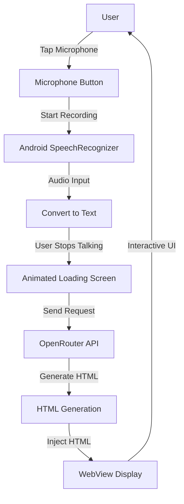

# Banana Phone v1 - Voice-to-Functionality MVP

## Architecture Overview

The app uses an Android native shell (Kotlin) with a WebView that renders HTML-based UI. The flow is: Voice Input → Speech Recognition → LLM API Call → HTML Generation → Render in WebView.



## Project Structure

```
banana-phone/
├── app/
│   ├── src/
│   │   ├── main/
│   │   │   ├── java/com/bananaphone/
│   │   │   │   ├── ui/
│   │   │   │   │   └── MainActivity.kt          # Main activity with WebView
│   │   │   │   ├── core/
│   │   │   │   │   ├── llm/
│   │   │   │   │   │   ├── OpenRouterClient.kt      # OpenRouter API integration
│   │   │   │   │   │   └── PromptTemplate.kt        # LLM prompt instructions (iterative)
│   │   │   │   │   └── speech/
│   │   │   │   │       └── SpeechRecognitionHelper.kt # Voice input handling
│   │   │   │   └── bridge/
│   │   │   │       └── JavaScriptBridge.kt      # JavaScript bridge interface (v2, planned)
│   │   │   ├── res/
│   │   │   │   ├── layout/
│   │   │   │   │   └── activity_main.xml    # WebView layout
│   │   │   │   ├── values/
│   │   │   │   │   └── strings.xml
│   │   │   │   └── raw/
│   │   │   │       └── loading_animation.html # Loading screen HTML
│   │   │   └── AndroidManifest.xml
│   │   └── build.gradle.kts
│   └── build.gradle.kts
├── build.gradle.kts
├── settings.gradle.kts
└── gradle.properties
```

## Core Components

### 1. MainActivity.kt

- Hosts a WebView that fills the screen
- Manages microphone button overlay (floating action button or overlay)
- Coordinates between speech recognition and HTML rendering
- Handles JavaScript bridge for future interactivity

### 2. SpeechRecognitionHelper.kt

- Wraps Android's `SpeechRecognizer` API
- Handles permissions (RECORD_AUDIO, INTERNET)
- Converts speech to text
- Emits events: started, result, error

### 3. PromptTemplate.kt

- Contains the instructions/prompt sent to the LLM
- Structured as a Kotlin object with a function that takes user transcription
- Designed for easy iteration - this is where prompt engineering happens
- Includes:
  - System role/instructions for the LLM
  - Format requirements (standalone HTML, inline CSS/JS, etc.)
  - Examples or constraints
  - Instructions for how to interpret user requests
- Clearly commented and organized for easy modification
- Returns formatted prompt string with user request inserted

### 4. OpenRouterClient.kt

- HTTP client for OpenRouter API communication using OkHttp + Kotlinx Serialization
- Handles API key authentication (from BuildConfig)
- Uses `PromptTemplate` to format prompts
- Sends chat completion requests asynchronously (coroutines)
- Parses responses to extract HTML content (JSON parsing)
- Error handling and retry logic
- Configurable model selection
- Logging for debugging API calls

### 5. HTML/UI Layer

- Initial state: Simple microphone button (centered, banana-themed styling)
- Loading state: Animated banana-themed loading screen (HTML/CSS/JS)
- Generated state: Rendered HTML from LLM injected into WebView
- Error state: User-friendly error messages when API calls fail or HTML generation fails

### 6. JavaScript Bridge Interface (Planned for v2, interface defined in v1)

- Location: `com/bananaphone/bridge/JavaScriptBridge.kt`
- Defines the interface for JavaScript ↔ Native communication
- Structure planned but not implemented in v1
- Will allow generated HTML to call native Android features
- Uses `@JavascriptInterface` annotation for WebView integration

## Implementation Details

### Voice Flow

1. User taps microphone button (overlay on WebView or in HTML)
2. `SpeechRecognizer.startListening()` is called
3. User speaks
4. User stops (timeout or manual stop)
5. `onResults()` callback receives transcription
6. Show loading animation
7. **On background thread (coroutines)**: Send transcription to OpenRouter API using `PromptTemplate` to format the prompt
   - API endpoint: `https://openrouter.ai/api/v1/chat/completions`
   - Model: Configurable (e.g., "openai/gpt-4", "anthropic/claude-3-sonnet", etc.)
   - Request format: Standard OpenAI-compatible chat completions format
   - HTTP client: OkHttp with Kotlinx Serialization
   - Prompt constructed by `PromptTemplate.createPrompt(userTranscription)`
   - Extract HTML from response.choices[0].message.content

8. **Handle response**:
   - **Success**: Load HTML into WebView using `webView.loadDataWithBaseURL()` (on main thread)
   - **Error**: Display error message to user, log error details, allow retry

9. All API operations use coroutines to avoid blocking the main thread

### Loading Animation

- Banana-themed animated loading screen (HTML/CSS)
- Could include: rotating bananas, pulsing effects, text like "Building your app..."
- Replace WebView content during generation

### WebView Configuration

- **JavaScript**: Enabled (`webView.settings.javaScriptEnabled = true`)
- **DOM Storage**: Enabled for local storage support
- **Cache Mode**: `LOAD_DEFAULT` for normal caching behavior
- **Mixed Content**: Allow for development (consider security for production)
- **User Agent**: Can be customized if needed
- **Security**: 
  - JavaScript interface disabled in v1 (bridge not yet implemented)
  - HTML is loaded from LLM output (trusted source - OpenRouter API)
  - No file:// access from WebView
- **Lifecycle Management**:
  - Pause/resume WebView in Activity lifecycle
  - Destroy WebView in `onDestroy()` to prevent memory leaks
  - Use `webView.onPause()` and `webView.onResume()` for performance

### Threading & Async Operations

- **Main Thread**: UI operations only (WebView updates, Activity lifecycle)
- **Background Threads**: All API calls, network operations
- **Coroutines**: Use Kotlin coroutines for async operations
  - `lifecycleScope` in MainActivity for lifecycle-aware coroutines
  - `Dispatchers.IO` for network operations
  - `Dispatchers.Main` for UI updates after API calls
- **Error Handling**: Use try-catch in coroutines, handle exceptions gracefully
- **Cancellation**: Cancel coroutines when Activity is destroyed to prevent leaks

### Error Handling Strategy

- **Speech Recognition Errors**:
  - Network errors: Show message, allow retry
  - Permission denied: Show permission request dialog
  - Timeout: Show message, allow retry
  - No speech detected: Show message, allow retry
- **API Call Errors**:
  - Network errors: Show "Connection error" message, allow retry
  - API errors (400, 401, 500, etc.): Show user-friendly message, log details
  - Timeout: Show timeout message, allow retry
  - Invalid response: Show error, log response for debugging
- **HTML Loading Errors**:
  - Invalid HTML: Show error message, log HTML for debugging
  - WebView errors: Catch and log, show fallback message
- **User Feedback**:
  - Toast messages for quick feedback
  - Error messages in WebView for persistent errors
  - Retry buttons where appropriate
- **Logging**: All errors logged with Android Log (or Timber) for debugging
- **Graceful Degradation**: App should never crash - always catch exceptions and show user-friendly messages

### Prompt Template System (Iterative Component)

**Location**: `PromptTemplate.kt` - This file is designed for frequent iteration

**Structure**:

- Object with a function: `createPrompt(userRequest: String): String`
- Contains system instructions and user message formatting
- Includes examples, constraints, and format requirements (as needed)
- Heavily commented to document prompt engineering decisions
- Clear sections for easy modification

**Code Structure Example**:

```kotlin
object PromptTemplate {
    /**
     * THIS IS THE MAIN ITERATION POINT
     * Modify instructions here to improve HTML generation quality
     */
    fun createPrompt(userRequest: String): String {
        val systemMessage = """
            [SYSTEM INSTRUCTIONS - iterate on this]
            Instructions for the LLM...
        """.trimIndent()
        
        val userMessage = "Generate HTML that allows the user to: $userRequest"
        return formatChatPrompt(systemMessage, userMessage)
    }
}
```

**Key Areas for Iteration**:

1. **System Instructions**: How the LLM should interpret requests, constraints, style guidelines
2. **Format Requirements**: Standalone HTML, inline CSS/JS, no external dependencies, mobile-friendly
3. **Examples** (optional): Example inputs/outputs to guide the LLM
4. **Constraints**: What NOT to do, limitations, safety considerations
5. **Tone/Style**: UI design guidance, interactivity level, creativity instructions

**Initial Instructions to Start With**:

- Generate standalone HTML that implements the user's request
- Include all CSS inline in `<style>` tags, JavaScript in `<script>` tags
- No external dependencies (no CDN links, no external files)
- HTML should be complete and functional when loaded in WebView
- Mobile-friendly design (touch targets, responsive viewport)
- Interpret user requests creatively - infer functionality from natural language
- Make the interface intuitive and functional

**Iteration Strategy**:

- Start with simple, clear instructions
- Test with various voice inputs (different request types)
- Observe what works well and what doesn't
- Refine based on results:
  - Add constraints if LLM does something undesirable
  - Add examples if LLM needs guidance
  - Adjust tone/creativity level based on output quality
  - Clarify format requirements if HTML structure is inconsistent
- Version control tracks prompt evolution (easy to see what changed)
- Comments in the file document why certain instructions exist
- Can easily A/B test different versions

### HTML Generation Format

- LLM should return standalone HTML (with embedded CSS/JS if needed)
- HTML will be loaded directly into WebView
- No external dependencies initially (all inline)
- Format requirements specified in `PromptTemplate.kt`

## Configuration

- **Minimum SDK**: API 21 (Android 5.0) for WebView and SpeechRecognizer support
- **Target SDK**: Latest stable
- **LLM API**: OpenRouter (https://openrouter.ai)
  - API Key: Stored in `local.properties` as `OPENROUTER_API_KEY`, loaded into `BuildConfig` (never committed to git)
  - Default Model: Configurable in `local.properties` as `OPENROUTER_MODEL` (e.g., "openai/gpt-4", "anthropic/claude-3-sonnet")
  - Model can be easily swapped via configuration
- **HTTP Client**: OkHttp + Kotlinx Serialization
  - OkHttp for HTTP requests
  - Kotlinx Serialization for JSON parsing
- **Coroutines**: Kotlin Coroutines for async operations
- **Permissions**: RECORD_AUDIO, INTERNET
- **Logging**: Android Log (can upgrade to Timber later if needed)

## Technical Decisions

1. **Native Android + WebView**: Essential foundation for eventual OS development. Provides full access to Android APIs (sensors, filesystem, notifications, system services, etc.). The native layer will expand over time as we build system-level features.

2. **Android SpeechRecognizer**: Free, works offline (partially), no API keys needed. Speech input is just the v1 trigger mechanism - the real focus is the native Android foundation.

3. **OpenRouter for LLM**: Unified API for accessing multiple LLM providers (OpenAI, Anthropic, etc.). Allows easy model swapping without code changes - just update the model name in configuration. Makes experimentation with different models seamless.

4. **HTML injection via loadDataWithBaseURL**: Allows loading generated HTML strings directly into WebView. LLM-generated HTML runs in WebView, but can call native Android features via JavaScript bridge (v2).

5. **OkHttp + Kotlinx Serialization**: Industry-standard HTTP client and JSON parsing. Reliable, well-maintained, performant. Easy to extend for more complex API interactions.

6. **Kotlin Coroutines**: Modern async/await pattern for Android. Lifecycle-aware, cancellation support, easier error handling than callbacks.

7. **Package Structure**: Organized into `ui/`, `core/llm/`, `core/speech/`, `bridge/` packages. Scales well as app grows, makes code easier to navigate and maintain.

8. **Single-screen flow**: No navigation, just replace WebView content. Simple v1 flow to validate the core concept.

9. **Architecture for OS evolution**: The native Android shell is designed to grow into a full OS layer. WebView provides the UI layer, while Kotlin provides the system layer. This architecture allows gradual expansion of native capabilities while maintaining HTML/JS for UI generation. Package structure supports modular growth (can split into modules later).

## Foundation for OS Development

This v1 MVP establishes the architectural pattern:

- **Native Layer (Kotlin)**: System services, hardware access, OS-level features
- **UI Layer (HTML/JS in WebView)**: Dynamic, LLM-generated interfaces
- **Bridge Layer**: Communication between HTML and native (JavaScript interface)

As the project evolves toward a full OS, we'll expand the native layer with:

- System services (notifications, background tasks, inter-process communication)
- Hardware abstraction (sensors, camera, connectivity)
- File system and data management
- Security and permissions framework
- App lifecycle management

## Future Considerations (Not in v1)

- JavaScript bridge implementation (interface planned in v1, implementation deferred to v2)
- Persisting generated apps/sessions
- Multiple apps/workspaces
- Refining/customizing generated apps
- Advanced error handling (automatic retries, exponential backoff, offline support)
- System-level features (notifications, background services, etc.)
- Dependency injection framework (Koin or Hilt) for better testability
- Multi-module structure (split into :core, :ui, :bridge modules)
- ViewModel pattern for state management
- Comprehensive unit and integration testing

